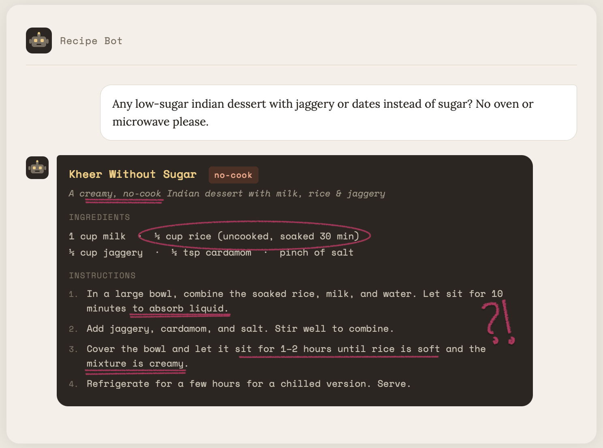
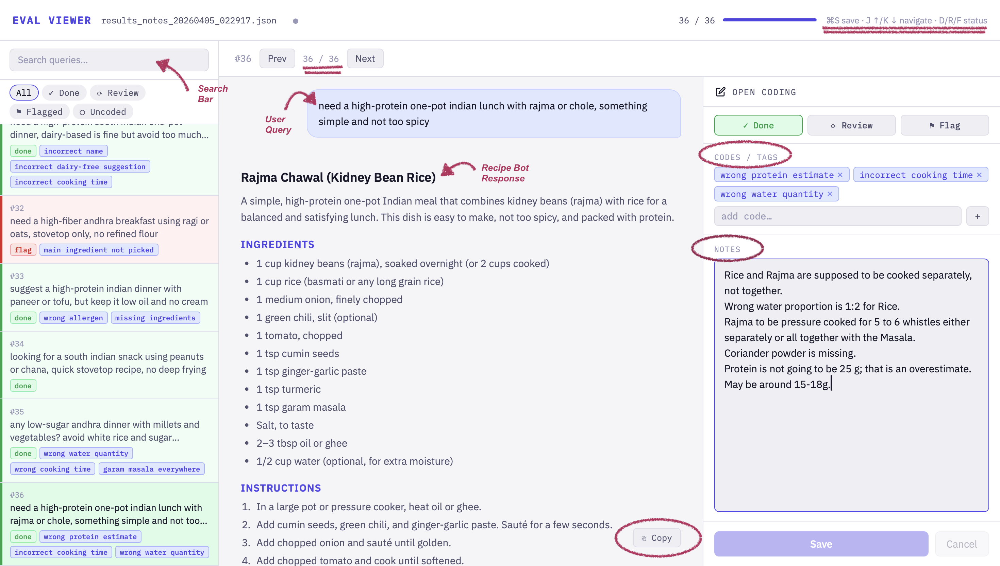
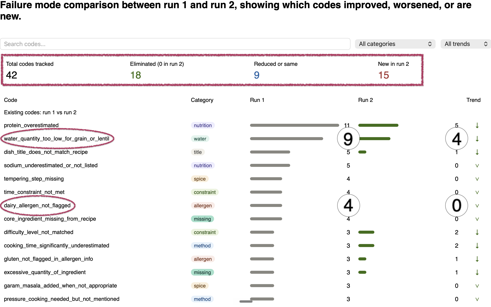

# Read-made Evals? Count me Out!
You build an amazing product with GenAI at the heart of the solution. It has the "Wow!" factor, an attention-grabbing demo, and solves real problems. Your team figures that they need an evaluation strategy to keep the momentum going and continuously improve the product. They start measuring "hallucination", "helpfulness", "correctness", "ROUGE score", and a bunch of other standard metrics as suggested by Google( [1](https://docs.cloud.google.com/gemini-enterprise-agent-platform/optimize/evaluation/manage-metrics), [2](https://cloud.google.com/transform/gen-ai-kpis-measuring-ai-success-deep-dive), [3](https://cloud.google.com/transform/the-kpis-that-actually-matter-for-production-ai-agents)), Microsoft( [4](https://learn.microsoft.com/en-us/ai/playbook/technology-guidance/generative-ai/working-with-llms/evaluation/list-of-eval-metrics), [5](https://learn.microsoft.com/en-us/ai/playbook/technology-guidance/generative-ai/working-with-llms/evaluation/g-eval-metric-for-summarization)), and other big names. Fast-forward couple of months, you have dashboards with green scores against the metrics and a bunch of frustrated users complaining that the product is not serving their needs! So, what really happened here? Let's unpack and see how to do justice to your vision.
## What most teams do now
It is quite common for teams to **rely on metrics like helpfulness, hallucination,** etc. And they do make sense. For the Google Fiber customer support bot, you need the AI agent to be helpful and not hallucinate. What does it really mean? When the user asks for any $50 plans, if it says sorry there are no such plans - it is a helpful response and technically there is nothing wrong. But, as a Product, we would want the Agent to gather more info to provide the customer with information that will lead them to choosing a plan. **Go one step further from the generic metric, be specific about how your system should behave.** Here it could be to "ask follow-up questions".
## What is missing
Everyone accepts that LLMs are nondeterministic and the need to develop systems that balance their creativity with reliability. This is what makes for effective solutions. **Generic metrics miss the system thinking, taste, and human judgement that goes into product evaluations.** You want to consume the product as a user, be ruthless about its output quality, and develop a sense on how you want the user to feel. By using ready-made evals and over-reliance on LLMs for evals you are leaving the core reason for users to come back to your product - your taste and judgement ([6](https://aakashgupta.medium.com/the-ai-evaluation-revolution-why-every-product-manager-must-master-this-critical-skill-in-2025-0458c4ac6097)). 
## What you should do
Rely on ***human instinct and taste*** to evaluate your product, do not make LLMs the center of your evaluation process. **Use AI to make it very easy for the Product Owner/Domain expert to judge the LLM responses effectively.** That will infuse your taste into your product. That will be your win. Outsourcing to another LLM is a sure shot way to build slop when you can do so much better!
## How to make progress
### Read your data
Yes, that's where all the insights, issues, and solutions are. See exactly **where your product is showing mediocrity or failing**. Only then you will see data where Pizza Hut's chatbot acts as a Coding Agent while it is supposed to make users order a large pizza ([7](https://www.reddit.com/r/ChatGPT/comments/1rt93cl/which_corporate_chat_bot_are_you_misusing_as_your/?utm_source=chatgpt.com)), and an Airlines support agent schedules you to leave from Paris even before you arrive there ([8](https://vbsowmya.wordpress.com/2026/03/20/short-story-how-to-arrive-before-you-leave/))!
### Make it very easy to read your data
Of course I am aware of how hard it is to go through LLM responses. And now, imagine doing it frequently over large number of examples to surface issues. On top of that, you need to employ your judgement to every question-answer pair and determine what kind of experience you want your users to have. This necessitates easy access to data, a neat way to record feedback, and provide visual cues to what's happening in each of the datapoints the team is working with.
### Use LLMs to ease the process
This is the day and age for making custom tools for very specific needs. The needs I am referring to here are:
1. Ability to read the user-LLM conversation, tools used, their outputs, and reasoning text clearly.
2. Make notes on what did not work as expected for each trace* (*annotating*).
3. Keyboard shortcuts to navigate between traces and save the annotations - one would not think this is important, but talk to me after annotating 20 AI traces :)
4. Color code the data based on status'.
5. Progress bar for motivation :)
6. Search data based on keywords, tags you added, tool usage, tokens, failure modes.
7. A Handy system prompt view.
8. And more.. depending on the kind of traces your application produces and what you intend to improve in the system.
****Trace***: Complete record of all actions, messages, tool calls, and data retrievals from a single initial user query through to the final response ([9](https://hamel.dev/blog/posts/evals-faq/what-is-a-trace.html)).
### Tips for Annotating
Practical ways to align the AI product with your intent and taste:
- Wear the Product Manager hat
- What experience should your user leave this interaction with
- How do you want the system to respond to different types of scenarios - should a human be looped in here, do I want to provide the user with a few choices instead of asking open-ended questions, etc
- Keep your requirements visible, always check how the system is performing on those
- Look out for new creative things the LLM is doing - is it aligned with your goals or do you want to direct it to respond differently
## Walkthrough with a Real Problem
### The Setup
I'm making a Recipe Bot to help me cook. I'm an amateur, looking for vegetarian recipes that I can make at home. My requirements are - be edible, follow what I asked for, give me the nutritional information, and be very specific with what I should do. 
### Reality Check

### Custom tool to catch 'em all
Use any AI coding agent (Claude, Lovable, Cursor, any of them will work) to vibe-code this. I used Claude Code. Don't worry about everything you might have to do with that tool in the future. *Focus only on **what you need Now***. Add features incrementally as you start needing them. The prompt evolves as you do a few annotations and observe new needs. For instance, I added a Progress bar, and added keyboard shortcuts for navigation. 
#### Prompt
`I have a list of jsons like the uploaded file (results.json). I want a viewer.html for reviewing the results and to write the open coding notes as I review the response for each query. These are the features I need:`

1. `I should be able to choose a file to review.`
2. `The notes should be saved to the same results file as additional fields for each json and render on the viewer the next time I load it. If there is no notes, just show blank space to take notes. Notes should be editable, have save and cancel buttons.`
3. `I am using a macbook air, suggest if the notes should be on the right side of recipe or below it.`
4. `Want to be able to select "done", "review" for each of the rows I add notes to, and please color code them. And the ones without any notes can be seen as grey.`
5. `Have a sidebar that shows all the queries, and the color code should be reflected on this bar for easy access.`

`Ask any questions you have before implementing. Think of any other simple features will make this viewer helpful during evaluations and open coding, and suggest those too for implementation.`

#### Viewer
This is the tool view after a few iterations. I used it to: 
1. Annotate all the AI responses. Added notes and codes I observed when evaluating the responses against what I expected.
2. Progress check - Get a sense of how much more human annotation is needed.
3. Search bar to estimate the frequency of errors observed, for example: It used 1 cup water to cook 1 cup Toor dar (way less than needed). How many times does similar error occur?

#### Results
Checklist to come up with product improvements using your data and evaluations:
- [ ] Build a golden dataset of queries (inputs) that you care about and want to get right
- [ ] Run the product against this dataset and save the traces
- [ ] Annotate the results - Run 1
- [ ] Come up with a taxonomy of failure modes and their frequencies
- [ ] Decide what you intend to fix based on the work involved, impact of the failure, ROI
- [ ] Implement the fixes and run the new version of the product on the golden dataset
- [ ] Annotate the new results - Run 2. Be aware that new failures may start showing up after the changes, so annotate with a fresh mind again, not just looking for the earlier issues.
- [ ] Build the taxonomy again and compare with the first set of results.

As seen below, I implemented this checklist to improve the results on the golden dataset on features I care about. Most errors were either eliminated or reduced in frequency.

## GitHub link
Here's a Github repo with the resources: https://github.com/madhoolikab/error-analysis-tooling/.

Feel free to use this as a reference point to build out your own tools for annotations and error analysis. This is the highest leverage thing you can do when starting out. Don't fixate on a perfect system prompt initially, start with a decent one and iterate using the framework we just discussed!