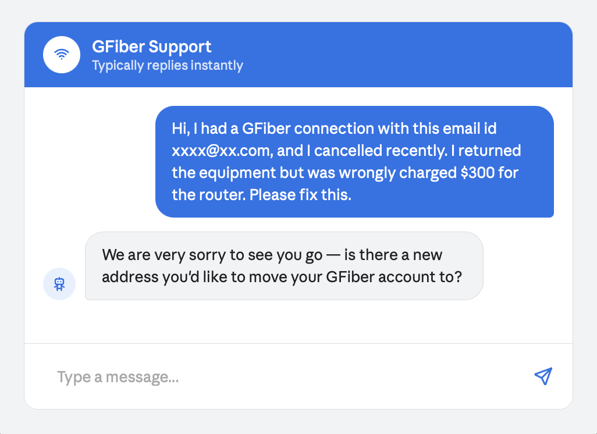
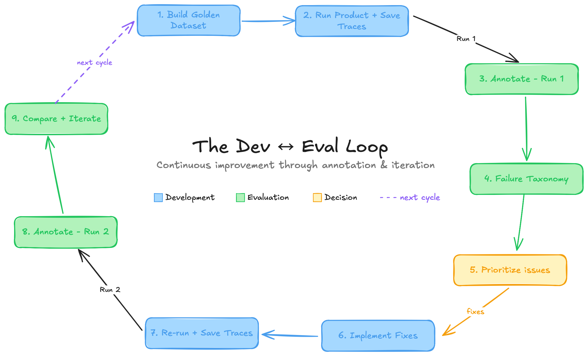
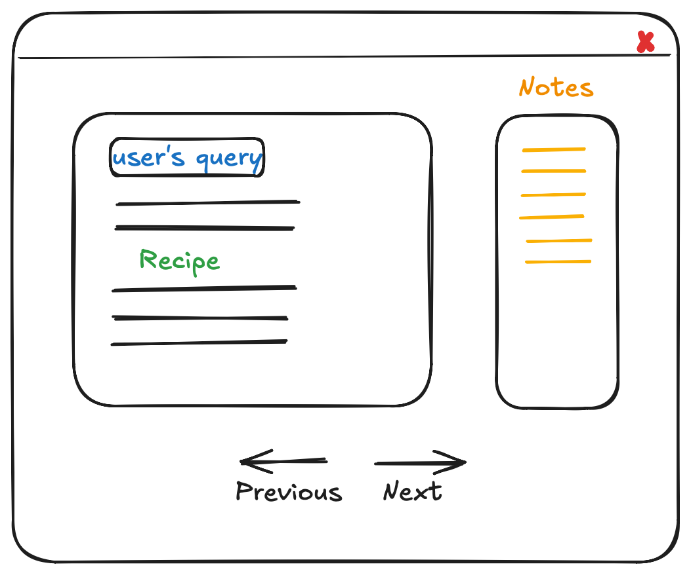

# Ready-made Evals? Count me Out!
You build an amazing product with GenAI at the heart of the solution. It has the "Wow!" factor, an attention-grabbing demo, and solves real problems. Your team figures that they need an evaluation strategy to keep the momentum going and to continuously improve the product. You start measuring "hallucination", "helpfulness", "correctness", "ROUGE score", and a bunch of other standard metrics as suggested by Google( [1](https://docs.cloud.google.com/gemini-enterprise-agent-platform/optimize/evaluation/manage-metrics), [2](https://cloud.google.com/transform/gen-ai-kpis-measuring-ai-success-deep-dive), [3](https://cloud.google.com/transform/the-kpis-that-actually-matter-for-production-ai-agents)), Microsoft( [4](https://learn.microsoft.com/en-us/ai/playbook/technology-guidance/generative-ai/working-with-llms/evaluation/list-of-eval-metrics), [5](https://learn.microsoft.com/en-us/ai/playbook/technology-guidance/generative-ai/working-with-llms/evaluation/g-eval-metric-for-summarization)), and other big names. Fast-forward couple of months, you have dashboards with green scores against the metrics and a bunch of frustrated users complaining that the product is not serving their needs! So, what really happened here? Let's unpack and see how to do justice to your vision.
## What most teams do now
It is quite common for teams to **rely on metrics like helpfulness, hallucination,** etc. And they do make sense. For the Google Fiber customer support agent, you need the it to be helpful and not hallucinate. What does it really mean? When the user asks for any $50 plans, if it says sorry there are no such plans - it is technically a helpful response, but, as a Product, we would want the Agent to also provide the customer with information that will lead them to choosing a plan. **Go one step further from the generic metric, be specific about how your system should behave.** Here it could be to "ask follow-up questions".
## What is missing
Everyone accepts that LLMs are nondeterministic and the need to develop systems that balance their creativity with reliability. **Generic metrics miss the system thinking, taste, and human judgement that goes into product evaluations.** Evaluate the product from a user point-of-view, be ruthless about its output quality, and develop a sense of how you want them to feel. By using ready-made evals and the over-reliance on LLMs for evals you are leaving the core reason for users to come back to your product - your taste and judgement ([6](https://aakashgupta.medium.com/the-ai-evaluation-revolution-why-every-product-manager-must-master-this-critical-skill-in-2025-0458c4ac6097)). 
## What you should do
Rely on your ***human judgement and taste*** to evaluate your product, do not make LLMs the center of your evaluation process. **Use AI to make it very easy for the Product Owner/Domain expert to judge the LLM responses effectively.** That will infuse your taste into the product. 

Consider this scenario:

I would never use a service again if an agent responded like this. Technically the agent is responding to the customer's message, but any human reading this trace would catch the problem immediately - *the customer wants their $300 back, not a new connection*. This kind of judgement is non-negotiable when evaluating AI responses. Outsourcing evals to another LLM is a sure-shot way to build slop when you can do so much better.
## Key Concepts (*Trace, Annotation, Open-Coding*)
### Trace
A Complete record of all actions, messages, tool calls, and data retrievals from a single initial user query through to the final response ([10](https://hamel.dev/blog/posts/evals-faq/what-is-a-trace.html)) forms a **Trace**.
### Annotation
Annotating is *simply writing down what went wrong and why, for each AI response you review*. A domain expert goes through each trace, notes what didn't work and what should change. These notes are called **Annotations**.
### Open-Coding 
Free flowing notes what did not work as expected, with a focus on *the initial failures seen in each trace* ([11](https://langfuse.com/academy/monitoring/error-analysis#error-analysis)). Similar to annotation, but focuses on the first failure in the entire trace.
## How to make progress
### Read your data
All the insights, issues, and solutions are in your application traces data. You get to see exactly **where your product is showing mediocrity or failing**. If you want to know that Pizza Hut's chatbot transforms into a Coding agent when it is supposed to place Pizza orders ([7](https://www.reddit.com/r/ChatGPT/comments/1rt93cl/which_corporate_chat_bot_are_you_misusing_as_your/?utm_source=chatgpt.com)), or that an Airlines AI agent is booking flights where you leave from Paris even before arriving there ([8](https://vbsowmya.wordpress.com/2026/03/20/short-story-how-to-arrive-before-you-leave/)), you need to read your application traces. 
### Build your Annotation Tool
I am aware of how hard it is to manually go through LLM responses. And imagine doing it frequently over a large number of examples to judge every question-answer pair and determine what should change. This necessitates easy access to data, a simple way to record feedback, and provide visual cues to what's identified in each of the datapoints the team is working with.

>**Reduce the friction** involved in reading and analyzing the data.

Building out a custom tool will help enormously. This is the day and age for making custom tools for very specific datasets you curate for evaluating your product. Use Nielsen's Ten Heuristic Principles ([9](https://www.nngroup.com/articles/ten-usability-heuristics/)) as guidance for UI design to speed up the process. Some features I found useful in such custom tools are:
1. Ability to read the user-LLM conversation, tools used, their outputs, and reasoning text clearly.
2. A view that matches the end-user's view.
3. Space to make notes on what did not work as expected for each datapoint.
4. Keyboard shortcuts for navigation and saving the notes - one would not think this is important, but talk to me after going through 100 traces!
5. Color code the rows based on status' (complete, to review, todo, etc).
6. Progress bar for motivation :). Human data analysis is one of the costliest parts of the LLM apps pipeline, a clear visible Progress bar of how much work is done/pending is helpful.
7. Search - based on keywords, tags you added, tool usage, tokens, failure modes.
8. A Handy system prompt view.
9. And more.. depending on the kind of traces your application produces and what you intend to improve in the system.

*Focus only on **what you need Now***. Don't worry about everything you might have to do with the tool in the future.  Add features incrementally as you start needing them. The tool evolves as you make progress and observe new needs.

>Insights on incremental development of the tool to target specific issues seen while annotating are in the example Walkthrough.

### How to Annotate Effectively
***Error analysis and annotations set the tone for how you improve the product.*** When you sit down to annotate, wear the Product Manager (PM) hat. Ask questions like, (i) what experience your user should leave with, (ii) how the system should handle edge cases, (iii) whether a human should be looped in. Keep your requirements visible and watch out for unexpected LLM behaviour - is it aligned with your goals or pulling in a direction you didn't intend?
### The Dev ↔ Eval ↔ Dev Loop
Many teams treat AI product development and evaluation as separate phases, build first and measure later. But across the AI solutions I've worked on, from Information Retrieval to Co-Pilots to Autonomous Agents, one thing is consistent: dev and evals must go hand-in-hand.

It is a continuous dance between development and evaluations. Evaluation results should port back into the development, which surfaces new failures and sharpen the next round of evals. That's how the product evolves into a reliable version.

Here's a checklist for you to implement this:
- [ ] Build a **golden dataset of queries (inputs)** that you care about and want to get right
- [ ] Run the product against this dataset and **save the traces**
- [ ] Open coding on traces - First run - these are your **baseline metrics**
- [ ] Come up with a **taxonomy of failure modes** and their frequencies
- [ ] **Prioritize the issues** based on the work involved, impact of the failure, ROI
- [ ] **Implement the fixes** and run the new version of the product (V2) on the golden dataset
- [ ] **Open coding on traces from V2 of product.** Be aware that new failures may start showing up after the changes, so proceed with a fresh mind, not only looking for the earlier issues.
- [ ] Build the taxonomy again and **compare with the baseline**.
- [ ] **Iterate on the product** and golden dataset until you reach the expected quality
## Walkthrough: Recipe Bot
I'm going to briefly discuss development of an app that uses GenAI, issues I faced with it, how I tracked the failures and reduced them by following this development ↔ error analysis ↔ development loop.
### The Setup
I'm making a Recipe Bot to help me cook. I'm an amateur, looking for vegetarian recipes that I can make at home. My requirements are - be edible, follow what I asked for, give me the nutritional information, and be very specific with what I should do.
### Reality Check
On spot checking with a few simple recipe requests, I noticed interesting hallucinated responses. Instructions to just ***soak rice in milk*** to make Kheer, **Rajma and rice cooked together** with very little water, and more such ideas.

### Why manually annotate, and how to make it Easier
With the Recipe Bot producing inedible, hallucinated results, I needed to understand the failure patterns systematically, and not just spot check. I wanted to speed things up and fed the query-response pairs to ChatGPT first to surface errors, and observed two major issues: 1) it flagged the same generic errors across all recipes (allergen information, cultural differences in preparation) 2) hallucinated problems that did not exist! 

This confirmed why the first round of annotations must be done manually. It **builds the intuition no LLM can give**. The need for human analysis lead to develop a custom tool to ease the process.

The tool I used finally looks nothing like the one I started with! I began with a barebones viewer with a single query-response view that matched what my user would see, a side panel for notes, and two arrow buttons to navigate between traces. That was enough to start.

But after annotating 10-11 recipes, things started feeling difficult.. When I noted the wrong amount of water for cooking rice and wanted to check where else it appeared, I had to click through every previous response and read my own notes one by one to find it. Obviously, I needed a Search bar that works across queries, recipes, and notes.

Some recipes needed a second look but there was no way to mark them. After tracking manually for a bit, they started becoming unmanageable. Realized that I need **color coded status labels** like todo, review, done, flagged that indicates the state of all traces at a gance.

By the time I was looking for patterns across all dessert recipes, clicking back and forth had become so painful that the sidebar view showing all queries as colour-coded rows, and **keyboard shortcuts** for navigation, saving notes stopped being nice-to-haves. They became must-haves for low friction error-analysis.

> Start minimal. Annotate. Let the friction tell you what to build next.

#### One-shot prompt for the tool 
Below is the prompt I used with Claude for such custom tool. Note that the `results.json` file with query id, query, and responses are uploaded too. I mentioned the features I needed, posed a design question, and asked to confirm if all looks good before implementing. 

You can **use this same prompt along with your data to get a custom tool** for your case! You can always improve it as you progress.

`I have a list of jsons like the uploaded file (results.json). I want a viewer.html for reviewing the results and to write the open coding notes as I review the response for each query. These are the features I need:`

1. `I should be able to choose a file to review.`
2. `The notes should be saved to the same results file as additional fields for each json and render on the viewer the next time I load it. If there is no notes, just show blank space to take notes. Notes should be editable, have save and cancel buttons.`
3. `I am using a macbook air, suggest if the notes should be on the right side of recipe or below it.`
4. `Want to be able to select "done", "review" for each of the rows I add notes to, and please color code them. And the ones without any notes can be seen as grey.`
5. `Have a sidebar that shows all the queries, and the color code should be reflected on this bar for easy access. Implement Search over the queries, should work based on query, response, notes, codes, and status.`
6. `Add a progress bar indicating the number of annotations completed/todo.`

`Ask any questions you have before implementing. Think of any other simple features will make this viewer helpful during evaluations and open coding, and suggest those too for implementation.`

#### The Viewer
This is the tool view after a few iterations. Feel free to zoom in and notice the details. I used it to: 
1. Conduct error analysis of all the AI responses. Added open coding notes and failure modes I observed when evaluating the responses against what I expected.
2. Progress check - Get a sense of how much more human annotation is needed.
3. Search bar to estimate the frequency of errors observed, for example: It used 1 cup water to cook 1 cup Toor dal (way less than needed). How many times does similar error occur?

### Results
I implemented the Dev ↔ Eval ↔ Dev Loop on a dataset of ~40 traces to identify issues, and either eliminate or reduce frequency of most errors. Here's a comparative view of the failure modes with frequencies, before and after the evals.

## Concluding Thoughts
Always bear in mind the probabilistic nature of LLMs and treat their responses for what they are - a model that has seen large amounts of text, captured the patterns within it, and can predict the next word well enough. When you introduce such a component into deterministic systems, they become non-deterministic too. Design your Evaluation strategy accounting for this reality with: ***human judgement, error analysis, and iteration***, rather than trying to make it work with generic readily available solutions.
### GitHub link
Here's a Github repo with the resources: https://github.com/madhoolikab/error-analysis-tooling/.

Feel free to use this as a reference point to build out your own tools for annotations and error analysis. This is the highest leverage thing you can do when starting out. Don't fixate on a perfect system prompt initially, start with a decent one and iterate using the framework we just discussed!
## References
https://docs.cloud.google.com/gemini-enterprise-agent-platform/optimize/evaluation/manage-metrics
https://cloud.google.com/transform/gen-ai-kpis-measuring-ai-success-deep-dive
https://cloud.google.com/transform/the-kpis-that-actually-matter-for-production-ai-agents
https://learn.microsoft.com/en-us/ai/playbook/technology-guidance/generative-ai/working-with-llms/evaluation/list-of-eval-metrics
https://learn.microsoft.com/en-us/ai/playbook/technology-guidance/generative-ai/working-with-llms/evaluation/g-eval-metric-for-summarization
https://aakashgupta.medium.com/the-ai-evaluation-revolution-why-every-product-manager-must-master-this-critical-skill-in-2025-0458c4ac6097
https://www.reddit.com/r/ChatGPT/comments/1rt93cl/which_corporate_chat_bot_are_you_misusing_as_your/?utm_source=chatgpt.com
https://vbsowmya.wordpress.com/2026/03/20/short-story-how-to-arrive-before-you-leave/
https://www.nngroup.com/articles/ten-usability-heuristics/
https://hamel.dev/blog/posts/evals-faq/what-is-a-trace.html
https://langfuse.com/academy/monitoring/error-analysis#error-analysis
